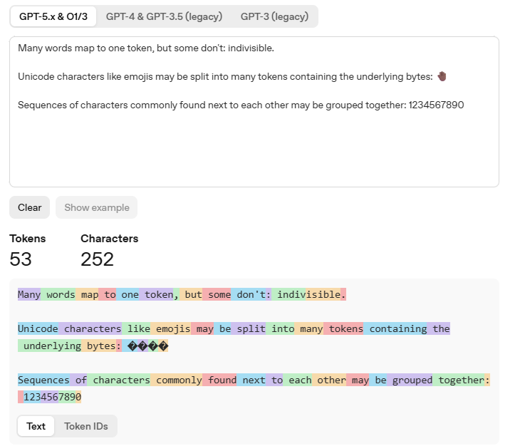
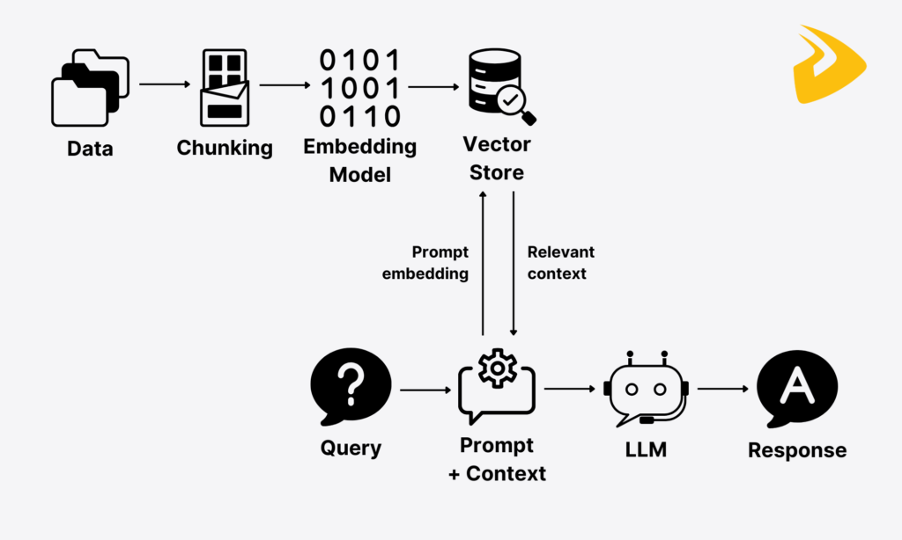

# LLMs and Data Research

---

## What is an LLM?

A **Large Language Model (LLM)** is a type of artificial intelligence model trained on vast amounts of text data to understand and generate human language. LLMs are built on a deep learning architecture called the **Transformer**, which allows the model to process and relate words across long stretches of text through a mechanism known as _attention_.

These models are trained on billions — sometimes trillions — of tokens drawn from books, websites, code, and other written sources. Through this training, they learn patterns in language, factual knowledge, and reasoning structures.

This makes LLMs highly flexible — a single model can perform summarisation, question answering, translation, classification, and code generation, often with little to no task-specific training required.

---

## Are LLMs Just a Big Database?

A common misconception is that an LLM is simply a very large database that stores and retrieves facts. This is not the case.

A database stores discrete, structured pieces of information that can be looked up exactly — query in, record out. An LLM, by contrast, does not store facts explicitly anywhere. Instead, it encodes statistical patterns across billions of parameters, learned from exposure to vast amounts of text. When asked a question, it does not look anything up — it _generates_ a response token by token based on what is statistically most likely given the input.

This means an LLM can reason, summarise, translate, and infer in ways a database never could, but it also means it can be wrong in ways a database never would be. A database will tell you it doesn't have the answer; an LLM may confidently generate one anyway.

---

## Examples of LLMs

Some of the most well-known LLMs include **GPT-4** by OpenAI, **Claude** by Anthropic, and **Gemini** by Google DeepMind.

On the open-source side, **LLaMA** by Meta AI and **Mistral** by Mistral AI have gained significant traction, allowing developers and researchers to run and fine-tune models without relying on proprietary APIs.

Each model varies in size, capability, and intended use case, but all share the same foundational architecture and training approach.

---

## What Can You Give LLMs for Their Training?

LLMs are trained in broadly three stages.

First, **pre-training** — the model is exposed to enormous amounts of text data and learns to predict the next token in a sequence, adjusting its billions of internal parameters through a process called backpropagation. This data spans a huge range of sources: **books and academic papers**, **websites and forums**, **code repositories**, **news articles**, **scientific literature**, **legal documents**, and even **social media**, giving the model a broad and varied understanding of language, facts, and reasoning across many domains. This stage is computationally expensive, often requiring thousands of GPUs running for weeks or months.

Second, **fine-tuning** — the pre-trained model is further trained on a narrower, curated dataset to specialise its behaviour for specific tasks or domains.

Third, **reinforcement learning from human feedback (RLHF)** — human raters evaluate the model's outputs and their preferences are used to further refine the model, making responses more accurate, helpful, and aligned with human expectations.

Together, these stages produce a model that is both broadly knowledgeable and practically useful.

---

## What, at a Base Level, are LLMs Trying to Do?

At its core, the goal of an LLM is to **understand and generate human language in a way that is useful, accurate, and contextually appropriate**.

Rather than following rigid, hand-coded rules, LLMs aim to generalise across tasks — acting as a flexible intelligence layer that can be applied to almost any problem involving language or reasoning.

In a data context specifically, the goal is to bridge the gap between **raw, unstructured information** and **human-readable insight**, enabling users to query, summarise, classify, and extract meaning from data without needing deep technical expertise. Ultimately, LLMs are designed to reduce friction between humans and information — making knowledge more accessible, workflows more efficient, and decision-making more informed.

---

## Prediction, Not Understanding

LLMs do not understand language the way humans do — they predict it. Every response an LLM generates is the result of calculating the most statistically likely next token given everything that came before it, drawn from patterns learned during training — repeating this process token by token until a complete response is formed. There is no comprehension, intent, or awareness behind the output — only probability.

This distinction matters enormously in practice. When an LLM answers correctly, it is because the correct answer was the most statistically likely continuation of the prompt. When it answers incorrectly, it is because a plausible-sounding but wrong answer was more probable given its training data. The model has no way of knowing the difference.

### Prediction in Practice — LLM Examples

To make this concept concrete, here are examples of prompts given to different LLMs and the kinds of accurate, useful responses they produce purely through next-token prediction:

- **GPT-4** — Asked _"What is the capital of France?"_, it correctly responds _"Paris"_ — not because it looked it up, but because "Paris" is the overwhelmingly likely next token following that question in its training data.
- **Claude** — Asked _"Summarise the causes of World War One in three sentences"_, it produces a coherent, accurate summary by predicting the most contextually appropriate continuation of that prompt.
- **Gemini** — Asked _"Write a Python function to reverse a string"_, it generates working, syntactically correct code because code patterns were heavily represented in its training data.
- **LLaMA** — Asked _"What is 15% of 340?"_, it correctly returns _"51"_ by predicting the numeric pattern that follows percentage calculation prompts.
- **Mistral** — Asked _"Translate 'good morning' into Japanese"_, it accurately returns _"おはようございます"_ — having learned the statistical relationship between English phrases and their Japanese equivalents across multilingual training data.
- **Grok** (xAI) — Asked _"What is the boiling point of water in Fahrenheit?"_, it correctly returns _"212°F"_ — predicting the well-established numeric fact that appears consistently throughout its training data.

In each case, no database was consulted — only pattern-based prediction.

---

## Tokens

### What is a Token?

A token is the basic unit of text that an LLM reads and processes. It is not always a full word — a token can be a whole word, a fragment of a word, a punctuation mark, or even a single character, depending on the model.

For example, the word _"unbelievable"_ might be split into multiple tokens such as _"un"_, _"believ"_, and _"able"_. On average, one token equates to roughly four characters or three quarters of a word in English.

Everything an LLM reads as input and produces as output is broken down into these tokens.

### What is Tokenisation?

Tokenisation is the process of converting raw text into a sequence of tokens before it is fed into the model. Rather than working with raw characters or whole words, tokenisation finds a middle ground that balances vocabulary size with meaningful language units.

This is handled by a **tokeniser** — a component that maps text to numerical token IDs that the model can mathematically process. The same tokeniser is used at both input and output, ensuring the model's predictions can be converted back into readable text.

Tokenisation is a foundational step in how LLMs work, as the model never sees raw text — only numbers.

### Why Do Tokens Matter?

Tokens matter for several practical and technical reasons.

First, **context windows** — the maximum amount of text an LLM can process at once — are measured in tokens, not words or characters. This means the length of both your input and the model's output is constrained by a token limit, which varies by model.

Second, tokens directly affect **cost**, as most LLM APIs charge per token consumed.

Third, how a piece of text is tokenised can subtly influence the model's output — unusual words, technical jargon, or other languages may be broken into more tokens, making them harder for the model to process efficiently.

Understanding tokens is therefore essential for anyone building or working with LLM-powered data applications.

---

## Context Windows

A context window is the maximum amount of text — measured in tokens — that an LLM can see and process at any one time. It encompasses everything the model has access to during a single interaction: the system instructions, the conversation history, any injected data or documents, and the response being generated.

If the total exceeds the context window limit, older content is dropped or the request fails entirely. Context windows vary significantly across models — some handle 4,000 tokens while others support 100,000 or more.

In a data context, this is particularly important as large documents, database outputs, or long conversation histories can quickly consume the available window. Understanding and managing the context window is therefore a critical consideration when designing LLM-powered data pipelines and applications.

### Mitigating Context Window Limitations

While context windows impose real constraints, there are several strategies to work around them:

- **Chunking** — breaking large documents into smaller segments and processing them independently, with results aggregated afterwards.
- **RAG (Retrieval Augmented Generation)** — only injecting the most relevant portions of a document into the prompt, rather than the entire source.
- **Summarisation pipelines** — compressing long histories or documents into shorter representations before passing them to the model, preserving key information while reducing token consumption.
- **Sliding window approaches** — processing long content in overlapping segments, maintaining continuity across chunks.
- **Choosing a model with a larger context window** — some models now support 128,000 tokens or more, which can alleviate the problem for many use cases.

In practice, a combination of these techniques is often used when building robust LLM-powered data applications.

---

## Hallucinations and Inaccurate Responses

One of the most well-documented limitations of LLMs is their tendency to **hallucinate** — producing responses that are confident in tone but factually incorrect, fabricated, or misleading.

This occurs because LLMs do not retrieve ground truth; they predict statistically likely outputs, which means plausibility and accuracy are not the same thing.

There are several common reasons why inaccurate responses occur:

- **Missing information** — if the model was never exposed to certain data during training, it may fill in the gaps with plausible-sounding but incorrect content.
- **Outdated information** — LLMs have a training cutoff date, meaning anything that has changed or emerged since then will not be reflected in their responses.
- **Weak or poorly constructed prompts** — vague, ambiguous, or underspecified inputs give the model little to anchor its response to, increasing the likelihood of drifting off course.
- **Ambiguity in the query** — if a question can be interpreted in multiple ways, the model may confidently answer the wrong interpretation without flagging the uncertainty.
- **Deleted or deprecated codebases** — in technical and data contexts particularly, LLMs may reference libraries, functions, or APIs that have since been removed or significantly changed, producing code that no longer works.

Awareness of these failure modes is essential when deploying LLMs in any data-driven environment.

---

## Training vs Retrieval

When working with LLMs, it is important to distinguish between two fundamentally different ways a model can access information: **training** and **retrieval**.

Training data is **static** — it is baked into the model's parameters at the point of training and cannot be updated without retraining or fine-tuning the model. This means the model's internal knowledge is frozen in time, reflecting only what it was exposed to before its cutoff.

Retrieval, on the other hand, is **dynamic** — relevant information is fetched at runtime from an external source such as a database, document store, or search index, and injected directly into the prompt as context before the model generates a response.

For example, a model trained up to 2023 may not know about a company's latest financial report, but if that report is retrieved and injected into the prompt, the model can reason over it accurately. Other examples include pulling live customer records from a CRM, fetching the latest product documentation, or querying a vector database for semantically similar content.

Used in isolation, each approach has clear limitations — but when combined, they form the most powerful configuration: the model brings broad reasoning and language ability from training, while retrieval grounds it in accurate, up-to-date, domain-specific information.

|                      | **Training**                                     | **Retrieval**                                    |
| -------------------- | ------------------------------------------------ | ------------------------------------------------ |
| **When it happens**  | Before deployment                                | At runtime                                       |
| **Data type**        | Static, frozen at cutoff                         | Dynamic, up-to-date                              |
| **How it's used**    | Baked into model parameters                      | Injected into the prompt as context              |
| **Core function**    | Learns language patterns                         | Fetches external information                     |
| **Cost**             | Expensive — requires significant compute         | Relatively lightweight                           |
| **Updateability**    | Slow to update — requires retraining             | Instantly updateable                             |
| **Data requirement** | Massive amounts of data required                 | Uses existing storage systems                    |
| **Example**          | General language understanding, coding knowledge | Latest financial reports, live customer data     |
| **Best for**         | Broad reasoning and general knowledge            | Domain-specific, current, or private information |

---

## External Data

One of the most powerful applications of LLMs in a data context is their ability to interact with **external data sources** that exist outside of the model's original training. This includes internal documents, support tickets, emails, company policies, and product data — none of which are likely to have been part of the model's training set, and all of which are subject to constant change.

Rather than retraining the model every time something is updated, external data is retrieved dynamically and injected into the prompt at runtime, allowing the model to reason over the most current version of that information.

This makes LLMs particularly valuable in enterprise and data environments, where the ability to query a knowledge base, summarise a policy document, or extract insight from a ticket history can dramatically accelerate workflows — without ever requiring the underlying model to be modified.

### Retrieval Augmented Generation (RAG)

**Retrieval Augmented Generation (RAG)** is the technique that brings external data and LLMs together in a structured, repeatable way. Rather than relying solely on what the model learned during training, RAG supplements the model's response by first retrieving relevant information from an external source and injecting it into the prompt before generation occurs.

At a high level, an LLM operating with RAG follows three core steps: first, **retrieving relevant data** from a source such as a database, document store, or search index; then **injecting that data as context** into the prompt, giving the model the information it needs to reason about; and finally **generating a response** grounded in both its training knowledge and the provided context.

In detail, the pipeline follows a clear sequence:

1. A **user submits a question**.
2. The system **retrieves relevant content** from an external data store — such as a document repository, knowledge base, or database.
3. The **most relevant documents are identified and added to the prompt** alongside the original query.
4. The **LLM processes the full prompt** — combining its training knowledge with the retrieved context.
5. The model **generates a grounded response** anchored in real, current information rather than prediction alone.

This is particularly powerful in data environments where information changes frequently or is too specific to have ever appeared in training data — such as internal policies, product catalogues, or customer records. RAG effectively gives the model a memory it was never trained with, making responses more accurate, more current, and more trustworthy than training alone could achieve.

---
