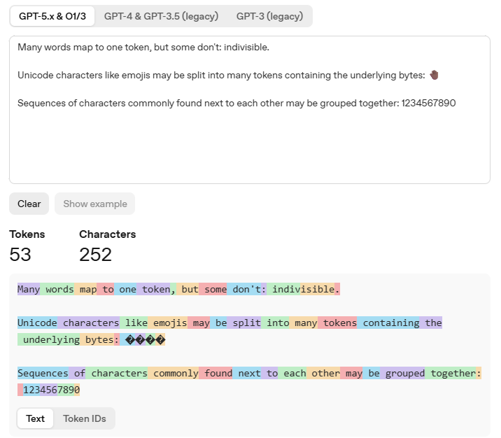
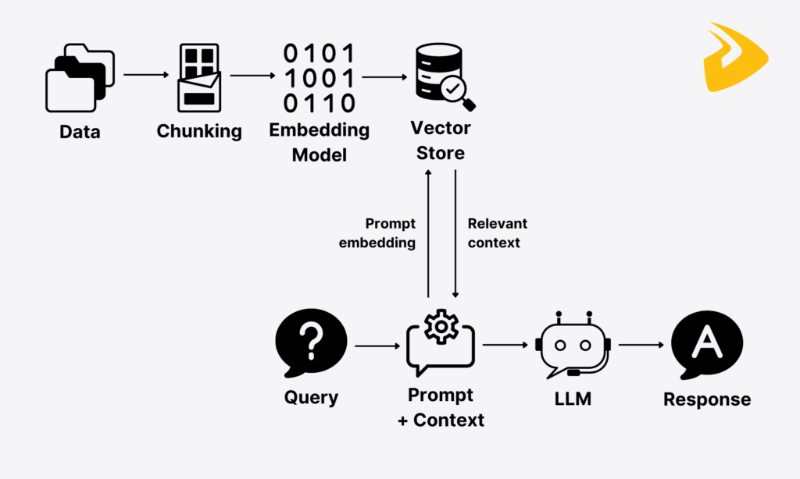
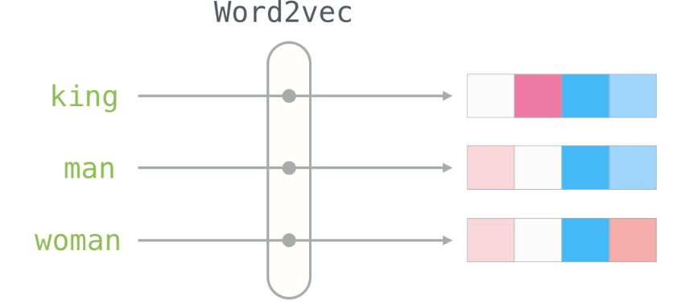
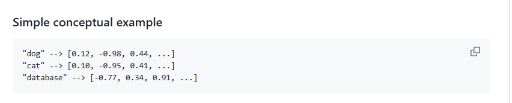
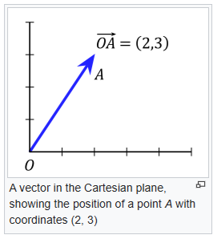
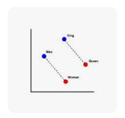
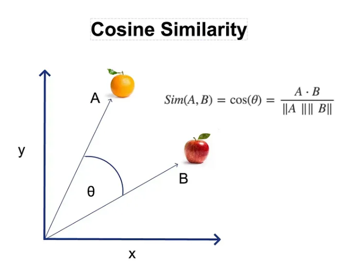

# LLMs and Data Research

---

## What is an LLM?

A **Large Language Model (LLM)** is a type of artificial intelligence model trained on vast amounts of text data to understand and generate human language. LLMs are built on a deep learning architecture called the **Transformer**, which allows the model to process and relate words across long stretches of text through a mechanism known as _attention_.

These models are trained on billions — sometimes trillions — of tokens drawn from books, websites, code, and other written sources. Through this training, they learn patterns in language, factual knowledge, and reasoning structures.

This makes LLMs highly flexible — a single model can perform summarisation, question answering, translation, classification, and code generation, often with little to no task-specific training required.

---

## Are LLMs Just a Big Database?

A common misconception is that an LLM is simply a very large database that stores and retrieves facts. This is not the case.

A database stores discrete, structured pieces of information that can be looked up exactly — query in, record out. An LLM, by contrast, does not store facts explicitly anywhere. Instead, it encodes statistical patterns across billions of parameters, learned from exposure to vast amounts of text. When asked a question, it does not look anything up — it _generates_ a response token by token based on what is statistically most likely given the input.

This means an LLM can reason, summarise, translate, and infer in ways a database never could, but it also means it can be wrong in ways a database never would be. A database will tell you it doesn't have the answer; an LLM may confidently generate one anyway.

---

## Examples of LLMs

Some of the most well-known LLMs include **GPT-4** by OpenAI, **Claude** by Anthropic, and **Gemini** by Google DeepMind.

On the open-source side, **LLaMA** by Meta AI and **Mistral** by Mistral AI have gained significant traction, allowing developers and researchers to run and fine-tune models without relying on proprietary APIs.

Each model varies in size, capability, and intended use case, but all share the same foundational architecture and training approach.

---

## What Can You Give LLMs for Their Training?

LLMs are trained in broadly three stages.

First, **pre-training** — the model is exposed to enormous amounts of text data and learns to predict the next token in a sequence, adjusting its billions of internal parameters through a process called backpropagation. This data spans a huge range of sources: **books and academic papers**, **websites and forums**, **code repositories**, **news articles**, **scientific literature**, **legal documents**, and even **social media**, giving the model a broad and varied understanding of language, facts, and reasoning across many domains. This stage is computationally expensive, often requiring thousands of GPUs running for weeks or months.

Second, **fine-tuning** — the pre-trained model is further trained on a narrower, curated dataset to specialise its behaviour for specific tasks or domains.

Third, **reinforcement learning from human feedback (RLHF)** — human raters evaluate the model's outputs and their preferences are used to further refine the model, making responses more accurate, helpful, and aligned with human expectations.

Together, these stages produce a model that is both broadly knowledgeable and practically useful.

---

## What, at a Base Level, are LLMs Trying to Do?

At its core, the goal of an LLM is to **understand and generate human language in a way that is useful, accurate, and contextually appropriate**.

Rather than following rigid, hand-coded rules, LLMs aim to generalise across tasks — acting as a flexible intelligence layer that can be applied to almost any problem involving language or reasoning.

In a data context specifically, the goal is to bridge the gap between **raw, unstructured information** and **human-readable insight**, enabling users to query, summarise, classify, and extract meaning from data without needing deep technical expertise. Ultimately, LLMs are designed to reduce friction between humans and information — making knowledge more accessible, workflows more efficient, and decision-making more informed.

---

## Prediction, Not Understanding

LLMs do not understand language the way humans do — they predict it. Every response an LLM generates is the result of calculating the most statistically likely next token given everything that came before it, drawn from patterns learned during training — repeating this process token by token until a complete response is formed. There is no comprehension, intent, or awareness behind the output — only probability.

This distinction matters enormously in practice. When an LLM answers correctly, it is because the correct answer was the most statistically likely continuation of the prompt. When it answers incorrectly, it is because a plausible-sounding but wrong answer was more probable given its training data. The model has no way of knowing the difference.

### Prediction in Practice — LLM Examples

To make this concept concrete, here are examples of prompts given to different LLMs and the kinds of accurate, useful responses they produce purely through next-token prediction:

- **GPT-4** — Asked _"What is the capital of France?"_, it correctly responds _"Paris"_ — not because it looked it up, but because "Paris" is the overwhelmingly likely next token following that question in its training data.
- **Claude** — Asked _"Summarise the causes of World War One in three sentences"_, it produces a coherent, accurate summary by predicting the most contextually appropriate continuation of that prompt.
- **Gemini** — Asked _"Write a Python function to reverse a string"_, it generates working, syntactically correct code because code patterns were heavily represented in its training data.
- **LLaMA** — Asked _"What is 15% of 340?"_, it correctly returns _"51"_ by predicting the numeric pattern that follows percentage calculation prompts.
- **Mistral** — Asked _"Translate 'good morning' into Japanese"_, it accurately returns _"おはようございます"_ — having learned the statistical relationship between English phrases and their Japanese equivalents across multilingual training data.
- **Grok** (xAI) — Asked _"What is the boiling point of water in Fahrenheit?"_, it correctly returns _"212°F"_ — predicting the well-established numeric fact that appears consistently throughout its training data.

In each case, no database was consulted — only pattern-based prediction.

---

## Tokens

### What is a Token?

A token is the basic unit of text that an LLM reads and processes. It is not always a full word — a token can be a whole word, a fragment of a word, a punctuation mark, or even a single character, depending on the model.

For example, the word _"unbelievable"_ might be split into multiple tokens such as _"un"_, _"believ"_, and _"able"_. On average, one token equates to roughly four characters or three quarters of a word in English.

Everything an LLM reads as input and produces as output is broken down into these tokens.



### What is Tokenisation?

Tokenisation is the process of converting raw text into a sequence of tokens before it is fed into the model. Rather than working with raw characters or whole words, tokenisation finds a middle ground that balances vocabulary size with meaningful language units.

This is handled by a **tokeniser** — a component that maps text to numerical token IDs that the model can mathematically process. The same tokeniser is used at both input and output, ensuring the model's predictions can be converted back into readable text.

Tokenisation is a foundational step in how LLMs work, as the model never sees raw text — only numbers.

### Why Do Tokens Matter?

Tokens matter for several practical and technical reasons.

First, **context windows** — the maximum amount of text an LLM can process at once — are measured in tokens, not words or characters. This means the length of both your input and the model's output is constrained by a token limit, which varies by model.

Second, tokens directly affect **cost**, as most LLM APIs charge per token consumed.

Third, how a piece of text is tokenised can subtly influence the model's output — unusual words, technical jargon, or other languages may be broken into more tokens, making them harder for the model to process efficiently.

Understanding tokens is therefore essential for anyone building or working with LLM-powered data applications.

---

## Context Windows

A context window is the maximum amount of text — measured in tokens — that an LLM can see and process at any one time. It encompasses everything the model has access to during a single interaction: the system instructions, the conversation history, any injected data or documents, and the response being generated.

If the total exceeds the context window limit, older content is dropped or the request fails entirely. Context windows vary significantly across models — some handle 4,000 tokens while others support 100,000 or more.

In a data context, this is particularly important as large documents, database outputs, or long conversation histories can quickly consume the available window. Understanding and managing the context window is therefore a critical consideration when designing LLM-powered data pipelines and applications.

### Mitigating Context Window Limitations

While context windows impose real constraints, there are several strategies to work around them:

- **Chunking** — breaking large documents into smaller segments and processing them independently, with results aggregated afterwards.
- **RAG (Retrieval Augmented Generation)** — only injecting the most relevant portions of a document into the prompt, rather than the entire source.
- **Summarisation pipelines** — compressing long histories or documents into shorter representations before passing them to the model, preserving key information while reducing token consumption.
- **Sliding window approaches** — processing long content in overlapping segments, maintaining continuity across chunks.
- **Choosing a model with a larger context window** — some models now support 128,000 tokens or more, which can alleviate the problem for many use cases.

In practice, a combination of these techniques is often used when building robust LLM-powered data applications.

---

## Hallucinations and Inaccurate Responses

One of the most well-documented limitations of LLMs is their tendency to **hallucinate** — producing responses that are confident in tone but factually incorrect, fabricated, or misleading.

This occurs because LLMs do not retrieve ground truth; they predict statistically likely outputs, which means plausibility and accuracy are not the same thing.

There are several common reasons why inaccurate responses occur:

- **Missing information** — if the model was never exposed to certain data during training, it may fill in the gaps with plausible-sounding but incorrect content.
- **Outdated information** — LLMs have a training cutoff date, meaning anything that has changed or emerged since then will not be reflected in their responses.
- **Weak or poorly constructed prompts** — vague, ambiguous, or underspecified inputs give the model little to anchor its response to, increasing the likelihood of drifting off course.
- **Ambiguity in the query** — if a question can be interpreted in multiple ways, the model may confidently answer the wrong interpretation without flagging the uncertainty.
- **Deleted or deprecated codebases** — in technical and data contexts particularly, LLMs may reference libraries, functions, or APIs that have since been removed or significantly changed, producing code that no longer works.

Awareness of these failure modes is essential when deploying LLMs in any data-driven environment.

---

## Training vs Retrieval

When working with LLMs, it is important to distinguish between two fundamentally different ways a model can access information: **training** and **retrieval**.

Training data is **static** — it is baked into the model's parameters at the point of training and cannot be updated without retraining or fine-tuning the model. This means the model's internal knowledge is frozen in time, reflecting only what it was exposed to before its cutoff.

Retrieval, on the other hand, is **dynamic** — relevant information is fetched at runtime from an external source such as a database, document store, or search index, and injected directly into the prompt as context before the model generates a response.

For example, a model trained up to 2023 may not know about a company's latest financial report, but if that report is retrieved and injected into the prompt, the model can reason over it accurately. Other examples include pulling live customer records from a CRM, fetching the latest product documentation, or querying a vector database for semantically similar content.

Used in isolation, each approach has clear limitations — but when combined, they form the most powerful configuration: the model brings broad reasoning and language ability from training, while retrieval grounds it in accurate, up-to-date, domain-specific information.

|                      | **Training**                                     | **Retrieval**                                    |
| -------------------- | ------------------------------------------------ | ------------------------------------------------ |
| **When it happens**  | Before deployment                                | At runtime                                       |
| **Data type**        | Static, frozen at cutoff                         | Dynamic, up-to-date                              |
| **How it's used**    | Baked into model parameters                      | Injected into the prompt as context              |
| **Core function**    | Learns language patterns                         | Fetches external information                     |
| **Cost**             | Expensive — requires significant compute         | Relatively lightweight                           |
| **Updateability**    | Slow to update — requires retraining             | Instantly updateable                             |
| **Data requirement** | Massive amounts of data required                 | Uses existing storage systems                    |
| **Example**          | General language understanding, coding knowledge | Latest financial reports, live customer data     |
| **Best for**         | Broad reasoning and general knowledge            | Domain-specific, current, or private information |

---

## External Data

One of the most powerful applications of LLMs in a data context is their ability to interact with **external data sources** that exist outside of the model's original training. This includes internal documents, support tickets, emails, company policies, and product data — none of which are likely to have been part of the model's training set, and all of which are subject to constant change.

Rather than retraining the model every time something is updated, external data is retrieved dynamically and injected into the prompt at runtime, allowing the model to reason over the most current version of that information.

This makes LLMs particularly valuable in enterprise and data environments, where the ability to query a knowledge base, summarise a policy document, or extract insight from a ticket history can dramatically accelerate workflows — without ever requiring the underlying model to be modified.

### Retrieval Augmented Generation (RAG)

**Retrieval Augmented Generation (RAG)** is the technique that brings external data and LLMs together in a structured, repeatable way. Rather than relying solely on what the model learned during training, RAG supplements the model's response by first retrieving relevant information from an external source and injecting it into the prompt before generation occurs.

The pipeline follows a clear sequence:

1. A **user submits a question**.
2. The system **retrieves relevant content** from an external data store — such as a document repository, knowledge base, or database.
3. The **most relevant documents are identified and added to the prompt** alongside the original query.
4. The **LLM processes the full prompt** — combining its training knowledge with the retrieved context.
5. The model **generates a grounded response** anchored in real, current information rather than prediction alone.

This is particularly powerful in data environments where information changes frequently or is too specific to have ever appeared in training data — such as internal policies, product catalogues, or customer records. RAG effectively gives the model a memory it was never trained with, making responses more accurate, more current, and more trustworthy than training alone could achieve.



### Rerankers

The retrieval step in a RAG pipeline — finding documents by cosine similarity — is fast and works well, but it is not perfectly precise. Embedding-based retrieval casts a wide net, returning the most semantically similar documents overall. However, similarity in vector space does not always translate to relevance for a specific query.

A **reranker** is a second model that sits after the initial retrieval step and scores each retrieved document more carefully against the query. Rather than comparing pre-computed vectors, a reranker reads the query and each document together — as a pair — and outputs a precise relevance score. The documents are then reordered by this score before the top results are passed to the LLM.

The result is a two-stage pipeline:

1. **Retrieval** — embedding-based search quickly narrows the full document store down to a candidate set (e.g. the top 50 results)
2. **Reranking** — the reranker scores each candidate against the query and reorders them, so only the most genuinely relevant documents (e.g. the top 5) make it into the prompt

This approach combines the speed of vector search with the precision of a model that actually reads the content. Rerankers are sometimes called **cross-encoders**, because they encode the query and document together rather than independently.

---

## Semantic Similarity

Semantic similarity is a measure of how alike two pieces of text are **in meaning**, rather than in exact wording. Two sentences can share no words in common and still be semantically similar — and two sentences can share many words while meaning entirely different things.

For example, _"The dog chased the ball"_ and _"The canine ran after the sphere"_ are worded completely differently but convey the same meaning. Conversely, _"I saw the bank"_ could refer to a riverbank or a financial institution — identical words, very different meanings depending on context.

This distinction matters enormously for LLMs, because language is rarely precise. Users don't always phrase questions the same way, documents don't always use the exact keywords you'd expect, and meaning is often implied rather than stated explicitly. A system that can only match on exact words will miss relevant information constantly.

### Why Traditional Databases Can't Do This

Traditional databases are built around **exact matching**. A SQL query with a `WHERE` clause looks for rows where a value precisely equals, contains, or matches a pattern. A `LIKE` search can find substrings, but it has no concept of meaning — it is purely character-level comparison. If the word isn't there, the record won't be returned.

Even traditional full-text search engines, which are more sophisticated, still rely primarily on **keyword frequency** — counting how often terms appear and ranking results accordingly. This approach, known as TF-IDF or BM25, is better than exact matching but still fundamentally operates on word overlap rather than meaning.

Neither approach can answer the question _"are these two things talking about the same concept?"_ — because they have no model of what words mean, only a record of whether they appear.

### Why Semantic Similarity Matters in a Data Context

In a data pipeline — particularly one involving RAG — semantic similarity is what allows the retrieval step to work effectively. Rather than searching for documents that contain the exact words in a user's query, the system finds documents that are **closest in meaning**, even if the wording is entirely different.

This is what makes modern search and retrieval so much more powerful than traditional keyword matching. A user asking _"how do I cancel my subscription?"_ can be matched to a document titled _"terminating your account"_ — because the underlying meaning is similar, even though none of the key words overlap. A traditional database query would return nothing.

Semantic similarity is typically computed by converting text into numerical representations called **embeddings**, and then measuring the distance between those representations in vector space — both of which are covered in the sections below.

---

## Embeddings

### What are Embeddings?

An embedding is a way of representing a piece of text — a word, sentence, or entire document — as a **list of numbers**. These numbers are not arbitrary; they are produced by a model that has learned to encode meaning, so that text with similar meanings produces similar numbers.

For example, the words _"king"_ and _"queen"_ would produce embeddings that are numerically close to each other, because the model has learned they occupy a similar region of meaning. The words _"king"_ and _"bicycle"_, by contrast, would produce embeddings that are numerically far apart.

Each embedding is typically a list of hundreds or thousands of numbers — for instance, a model might represent every piece of text as a list of 1,536 numbers. This list is called a **vector**, and the space defined by all possible vectors is called **vector space** — both explored in the next section.





### Why are Embeddings Important in AI Systems?

Embeddings are the bridge between human language and mathematics. Without them, a computer has no way to reason about the _meaning_ of text — it can only compare characters and count words. With embeddings, meaning becomes a measurable quantity that can be stored, searched, and compared at scale.

This makes embeddings foundational to several critical capabilities in AI systems:

- **Semantic search** — instead of matching keywords, a search system converts the query into an embedding and finds the stored documents whose embeddings are closest in value, returning results that are similar in meaning rather than wording.
- **RAG retrieval** — when a user asks a question, it is embedded and compared against a database of pre-embedded documents to find the most relevant ones to inject into the prompt.
- **Recommendations** — products, articles, or content can be embedded and compared so that similar items are surfaced to users, even if they share no descriptive keywords.
- **Classification** — text can be categorised by comparing its embedding against known reference embeddings, without needing hand-coded rules.
- **Clustering** — large volumes of text can be grouped by meaning automatically, useful for analysing support tickets, customer feedback, or research documents at scale.

In short, embeddings allow AI systems to work with language the way humans do — by meaning, not by exact words. They are what makes semantic similarity computable, and what makes modern AI-powered search and retrieval fundamentally different from anything that came before.

---

## Vectors

### What are Vectors?

A vector is simply a **list of numbers**. In mathematics, a vector represents both a magnitude (size) and a direction — typically visualised as an arrow pointing from one location to another in space.

In the context of LLMs and embeddings, a vector is the numerical form that a piece of text takes after being processed by an embedding model. When a model converts the word _"king"_ into an embedding, the result is a vector — a long list of numbers that encodes where that word sits in the model's learned understanding of language.

### Example of a Vector

The diagram below shows a simple 2D vector — an arrow from the origin point O to point A at coordinates (2, 3).



In this example, the vector is represented as (2, 3) — two numbers defining its position in space. In a real embedding model, a vector works the same way but instead of 2 numbers it might have 768, 1,536, or even more — one number per dimension. The principle is identical: a fixed list of numbers that places the word or sentence at a precise location in a high-dimensional space.

---

## Vector Space

Vector space is the **shared environment in which all vectors exist**. When an embedding model converts thousands of words or sentences into vectors, every single one of them gets placed into the same space — meaning their positions can be directly compared against one another.

Think of it like a map. Each word is a pin dropped at a specific location. Words with similar meanings end up pinned close together. Words with very different meanings end up far apart. The map itself — the space containing all those pins — is the vector space.

The diagram below illustrates this with a small set of words. Notice how _King_ and _Queen_ sit close together, as do _Man_ and _Woman_ — and how the relationships between them are consistent and directional.



This is what makes vector space so powerful in AI systems. Rather than asking _"do these two things share any words?"_, the system can ask _"how close are these two things in space?"_ — a question that naturally captures meaning, context, and relationship in a way keyword matching never could.

---

## Cosine Similarity

### What is Cosine Similarity?

Cosine similarity is the method most commonly used to measure how similar two vectors are in vector space. Rather than measuring the straight-line distance between two points, it measures the **angle between two vectors** — and it is this angle that determines similarity.

The smaller the angle between two vectors, the more similar they are. If two vectors point in exactly the same direction, the angle between them is 0° and their cosine similarity is 1 — perfectly similar. If they point in completely opposite directions, the angle is 180° and their cosine similarity is -1 — completely dissimilar. Most comparisons fall somewhere in between.

Angle is used rather than straight-line distance because it only captures the **direction** of the vectors, which is where meaning lives — unaffected by how long or short each vector is.



In the diagram above, vectors A and B represent two different items — an orange and an apple. The angle θ between them is what cosine similarity measures. A small θ means the two items are close in meaning; a large θ means they are far apart.

### Why it Matters

In a RAG pipeline, when a user submits a query it is converted into a vector. That vector is then compared against all stored document vectors using cosine similarity. The documents with the highest similarity scores — the smallest angles — are the ones retrieved and injected into the prompt. This is the mechanism that makes semantic search work: not keyword overlap, but directional proximity in vector space.

---

## Code Examples

The following scripts put the concepts above into practice. Each one builds on the last.

---

### embeddings_demo.py — Generating and Comparing Embeddings

This script illustrates what embeddings are and how cosine similarity works in practice.

**Step 1 — Load a model and define sentences**

```python
from sentence_transformers import SentenceTransformer
from sklearn.metrics.pairwise import cosine_similarity

model = SentenceTransformer('all-MiniLM-L6-v2')

sentences = [
    "Machine learning is powerful",
    "Artificial intelligence is growing rapidly",
    "Pizza tastes great"
]
```

`SentenceTransformer` loads a pre-trained embedding model. `all-MiniLM-L6-v2` is a lightweight model that converts sentences into 384-dimensional vectors. The three sentences are deliberately chosen — two are semantically related (ML and AI), one is completely unrelated (pizza).

**Step 2 — Generate embeddings**

```python
embeddings = model.encode(sentences)
```

`model.encode()` converts each sentence into a vector of 384 numbers. The result is a NumPy array of shape `(3, 384)` — 3 sentences, 384 numbers each.

**Step 3 — Compute the similarity matrix**

```python
similarity_matrix = cosine_similarity(embeddings, embeddings)
```

This compares every embedding against every other embedding, producing a 3×3 grid where each cell `[i][j]` is the cosine similarity score between sentence `i` and sentence `j`. The diagonal is always `1.0` — a sentence is perfectly similar to itself.

**Step 4 — Print unique pairs only**

```python
for i in range(len(sentences)):
    for j in range(i + 1, len(sentences)):
        score = similarity_matrix[i][j]
        print(f"{sentences[i]!r} vs {sentences[j]!r}: {score:.4f}")
```

`j = i + 1` ensures each pair is only printed once — comparing A vs B and B vs A would give the same score, so the upper triangle of the matrix is all that's needed. The result shows high similarity between the ML and AI sentences, and low similarity between either of them and the pizza sentence — exactly what you'd expect from a model that understands meaning.

---

### vector_search.py — Building a FAISS Vector Search Index

This script shows how embeddings are stored in a searchable index using FAISS, and how a natural language query retrieves the most relevant documents.

**Step 1 — Define documents and generate embeddings**

```python
model = SentenceTransformer('all-MiniLM-L6-v2')

documents = [
    "Machine learning uses data",
    "Python is a programming language",
    "Football is a popular sport"
]

embeddings = model.encode(documents).astype('float32')
```

Each document is converted to a 384-dimensional vector. `.astype('float32')` converts the numbers to 32-bit floats — FAISS requires this specific format.

**Step 2 — Create and populate the FAISS index**

```python
dimension = embeddings.shape[1]
index = faiss.IndexFlatL2(dimension)
index.add(embeddings)
```

`embeddings.shape[1]` gives `384` — the size of each vector. `IndexFlatL2` creates the simplest FAISS index type: it stores all vectors and searches using L2 distance (straight-line distance between two points in vector space). `index.add()` loads all document embeddings into the index.

**Step 3 — Encode a query and search**

```python
query = model.encode(["What programming languages are there?"]).astype('float32')
distances, indices = index.search(query, k=2)
```

The query is converted into a vector using the same model, then `index.search()` finds the `k=2` closest document vectors. It returns `distances` (how far each result is — lower is better) and `indices` (the position of each result in the `documents` list).

**Step 4 — Print results**

```python
for rank, (idx, dist) in enumerate(zip(indices[0], distances[0])):
    print(f"{rank + 1}. {documents[idx]!r} (distance: {dist:.4f})")
```

`indices[0]` and `distances[0]` are the results for the first query. The loop pairs each result index with its distance and prints the matching document text. "Python is a programming language" ranks first — even though the query shares no words with it, the meaning is close in vector space.

---

### semantic_search.py — Interactive Semantic Search

This script combines everything into a practical semantic search system where the user types a query in natural language and gets back the most relevant documents.

**Step 1 — Build the document store and index**

```python
model = SentenceTransformer('all-MiniLM-L6-v2')

documents = [
    "Python is a popular programming language used in data science",
    "Machine learning is a subset of artificial intelligence",
    ...
]

embeddings = model.encode(documents).astype('float32')
index = faiss.IndexFlatL2(embeddings.shape[1])
index.add(embeddings)
```

The same setup as `vector_search.py` — documents are encoded and stored in the FAISS index before any searching happens. This is the offline step: in a real system, you'd do this once and persist the index to disk.

**Step 2 — Accept a user query at runtime**

```python
query = input("Search: ")
```

`input()` pauses the programme and waits for the user to type a question. Whatever they type becomes the query string — this is what makes it interactive rather than hardcoded.

**Step 3 — Encode the query and retrieve results**

```python
query_embedding = model.encode([query]).astype('float32')
distances, indices = index.search(query_embedding, k=3)
```

The user's query is converted to a vector on the fly using the same model, then FAISS finds the top 3 closest documents.

**Step 4 — Display results**

```python
for rank, (idx, dist) in enumerate(zip(indices[0], distances[0])):
    print(f"{rank + 1}. {documents[idx]!r} (distance: {dist:.4f})")
```

Results are printed ranked by distance. Searching _"what's in France"_ returns Paris first and the Eiffel Tower second — neither result contains the word "France" in a way that traditional keyword search would catch, but the semantic meaning is close enough for the model to retrieve them correctly.

This is the core of how RAG retrieval works in practice: a question comes in, gets embedded, and the closest documents in vector space are returned to be injected into an LLM prompt.
