# Databricks and PySpark Research

---

## What is "Big Data"?

"Big Data" refers to datasets that are too large, fast-moving, or varied to be processed efficiently by traditional database tools. The canonical definition is the **3 Vs**:

- **Volume** — terabytes to petabytes of data (e.g., all tweets ever sent, years of sensor readings)
- **Velocity** — data arriving continuously or in real time (e.g., financial trades, IoT streams)
- **Variety** — structured tables, semi-structured JSON/XML, unstructured text, images, logs

A rough rule of thumb: if it fits comfortably in memory on a single machine and a SQL query runs in seconds, it's not Big Data. Once you need to distribute the work across many machines to finish in a reasonable time, you're in Big Data territory. In practice this often starts around tens of gigabytes and becomes unavoidable in the hundreds-of-gigabytes-to-petabytes range.

---

## What is OLTP?

**OLTP (Online Transaction Processing)** describes systems designed to handle a high volume of short, discrete read/write operations — the kind that power day-to-day applications.

Examples: recording a purchase, updating a user's address, transferring money between bank accounts.

Characteristics:
- Optimised for fast inserts, updates, and deletes on individual rows
- Highly normalised schemas (many tables, minimal redundancy)
- Low latency per query (milliseconds)
- Many concurrent users
- Small result sets per query

Examples of OLTP databases: PostgreSQL, MySQL, Oracle DB, SQL Server.

### What is ACID?

ACID is the set of guarantees that make OLTP databases reliable when multiple operations happen concurrently:

| Property | Meaning |
|---|---|
| **Atomicity** | A transaction either completes fully or not at all. If a bank transfer fails halfway through, neither the debit nor the credit is applied. |
| **Consistency** | Every transaction brings the database from one valid state to another. Rules like "balance cannot be negative" are never violated. |
| **Isolation** | Concurrent transactions don't interfere with each other — each sees a consistent snapshot, as if it ran alone. |
| **Durability** | Once a transaction is committed, it survives crashes. The data is written to disk and won't disappear. |

ACID guarantees are expensive to implement at scale, which is one reason OLTP systems struggle with analytical workloads.

---

## What is OLAP?

**OLAP (Online Analytical Processing)** describes systems designed for complex queries that aggregate large volumes of historical data — the kind that power dashboards, reports, and business intelligence.

Examples: "What were total sales by region for last quarter?", "Which products have declining month-over-month revenue?"

Characteristics:
- Optimised for reads over massive amounts of data
- Denormalised schemas (fewer joins, wide tables)
- Queries scan many rows but return summarised results
- Low concurrency (analysts, not millions of users)
- Columnar storage (only reads the columns needed)

Examples of OLAP systems: Snowflake, Google BigQuery, Amazon Redshift, ClickHouse, Apache Druid.

**Key difference from OLTP:** OLTP is optimised for *writing* individual records fast; OLAP is optimised for *reading* across millions of records fast.

---

## What are Data Warehouses?

A **Data Warehouse** is a central repository that consolidates data from multiple OLTP systems (and other sources) into a single, query-optimised store for analytics.

### How they work

1. **Extract, Transform, Load (ETL)** — data is pulled from source systems (CRM, ERP, web logs), cleaned and standardised, then loaded into the warehouse on a schedule (typically nightly).
2. **Columnar storage** — data is stored column-by-column rather than row-by-row. Analytical queries that touch only a few columns become dramatically faster because irrelevant data is never read from disk.
3. **Denormalised schemas** — common patterns are the star schema (one central fact table surrounded by dimension tables) and snowflake schema. Fewer joins means faster queries.
4. **Massively Parallel Processing (MPP)** — queries are split across many nodes, each processing a slice of the data in parallel, then results are merged.

### Limitations

- Rigid schemas: changing the structure is costly (ETL pipelines must be updated)
- Expensive to store raw or unstructured data
- Historically required data to be structured before ingestion ("schema-on-write")
- Proprietary formats — data is locked into the warehouse vendor

---

## What are Data Lakes?

A **Data Lake** is a centralised storage repository that holds raw data in its native format — structured, semi-structured, or unstructured — at any scale, at low cost.

### How they work

- Data lands in the lake without transformation ("schema-on-read" — structure is applied at query time, not at ingestion)
- Built on cheap object storage: AWS S3, Azure Data Lake Storage (ADLS), Google Cloud Storage
- Supports all file formats: CSV, JSON, Parquet, Avro, images, logs, video
- Processing engines (Spark, Hive, Presto) read the files directly from storage

### Advantages over warehouses

- Cheap storage at massive scale
- Accepts any data type without up-front schema design
- Raw data is preserved — you can reprocess it with different logic later
- Works with open formats that aren't locked to a vendor

### Limitations

- No ACID transactions by default — concurrent writes can corrupt data
- No schema enforcement — "data swamp" problem: garbage data accumulates
- Poor query performance on raw files vs. a tuned warehouse
- No versioning or time travel

---

## What are Data Lakehouses?

A **Data Lakehouse** is an architecture that combines the low-cost, flexible storage of a Data Lake with the reliability and performance of a Data Warehouse — eliminating the need to maintain two separate systems.

The core idea: add a **transactional metadata layer** on top of cheap object storage (S3/ADLS/GCS) that gives files warehouse-like properties:

- ACID transactions
- Schema enforcement and evolution
- Indexing and statistics for fast query planning
- Time travel (query data as it looked at a past point in time)

The result: one place to store all data (raw, curated, ML-ready), with SQL analytics running directly on it at warehouse-grade performance.

Technologies that implement the Lakehouse pattern: **Delta Lake**, Apache Iceberg, Apache Hudi.

---

## What are Delta Lakes?

**Delta Lake** is an open-source storage layer developed by Databricks that brings ACID transactions and reliability to data stored in object storage (S3, ADLS, GCS).

It is the specific technology that powers the Lakehouse architecture in Databricks.

### How Delta Lake works

- Data is stored as **Parquet files** — a compressed, columnar open format
- Alongside the Parquet files sits a **transaction log** (the `_delta_log/` directory): a series of JSON files recording every change ever made to the table
- Every read or write first consults the transaction log to determine exactly which files constitute the current (or historical) version of the table
- This log is what enables:

| Feature | How the log enables it |
|---|---|
| **ACID transactions** | Two writers can't corrupt each other — the log serialises commits |
| **Time travel** | Query an earlier version by reading an earlier point in the log |
| **Schema enforcement** | Writes that don't match the schema are rejected |
| **Upserts and deletes** | Supported properly (MERGE, UPDATE, DELETE statements) |
| **Audit history** | Full record of who changed what and when |

### Delta Lake vs "raw" Parquet on S3

Raw Parquet files on S3 are just files — no coordination, no history, no guarantees. Delta Lake wraps them in a protocol that makes them behave like a database table, while keeping all data in open formats you own.

---

## What is Apache Spark?

**Apache Spark** is an open-source, distributed computing engine for processing large datasets across a cluster of machines. It provides a unified API for batch processing, streaming, SQL queries, machine learning, and graph computation.

### What problem did it solve?

Before Spark (circa 2009–2012), the dominant big data tool was **Hadoop MapReduce**. MapReduce had fundamental limitations:

- **Disk I/O bottleneck:** Every step of a computation wrote results to disk (HDFS) before the next step could read them. Multi-stage pipelines were extraordinarily slow.
- **No interactive queries:** You had to write Java code and submit a job — no notebook-style exploration.
- **No in-memory caching:** Iterative algorithms (like machine learning model training, which loops over data many times) reloaded data from disk on every iteration — making ML on Hadoop practically unusable.
- **Complex to program:** MapReduce forced everything into a two-step map/reduce paradigm. Simple logic required hundreds of lines of Java.

Spark solved all of these:

- **In-memory processing:** Intermediate results are kept in RAM across stages. Spark is typically **10–100× faster** than MapReduce for iterative workloads.
- **Lazy evaluation and DAGs:** Instead of executing immediately, Spark builds a directed acyclic graph (DAG) of transformations and executes them optimally in one pass.
- **High-level APIs:** DataFrames and Datasets let you write concise, SQL-like code.
- **Unified engine:** One tool handles batch, streaming, SQL, ML, and graph — no separate systems for each.

### How does it work? Architecture

```
┌─────────────────────────────────────────────────────────┐
│                    Driver Program                        │
│  - Runs your application code                           │
│  - Creates the SparkContext / SparkSession              │
│  - Builds the execution plan (DAG)                      │
│  - Coordinates work                                     │
└───────────────────┬─────────────────────────────────────┘
                    │ sends tasks
          ┌─────────▼──────────┐
          │   Cluster Manager  │  (YARN, Kubernetes, Spark Standalone, Databricks)
          │   Allocates resources
          └──┬──────────┬──────┘
             │          │
    ┌────────▼──┐  ┌────▼───────┐
    │ Executor  │  │ Executor   │  ... (one per node / core group)
    │ - Runs    │  │ - Runs     │
    │   Tasks   │  │   Tasks    │
    │ - Holds   │  │ - Holds    │
    │   cached  │  │   cached   │
    │   data    │  │   data     │
    └───────────┘  └────────────┘
```

**Key concepts:**

- **Driver** — the process running your code. It plans the computation and dispatches tasks.
- **Executors** — worker processes on cluster nodes. They actually run the computations and store cached data in memory.
- **RDD (Resilient Distributed Dataset)** — the original low-level abstraction: an immutable, partitioned collection of records distributed across the cluster. Fault-tolerant — if a partition is lost, Spark re-computes it from the lineage.
- **DataFrame** — the high-level abstraction (built on top of RDDs). Like a SQL table with named, typed columns. Optimised automatically by the **Catalyst query optimiser** and executed via **Tungsten** (memory-efficient binary format).
- **Transformations vs Actions:**
  - *Transformations* (`.filter()`, `.select()`, `.groupBy()`) are lazy — they just add a step to the plan.
  - *Actions* (`.show()`, `.count()`, `.write()`) trigger actual execution of the full plan.
- **Partitions** — data is split into chunks. Each partition is processed by one task on one executor. More partitions = more parallelism (up to the number of CPU cores available).

### Why did it become popular?

1. **Speed** — in-memory processing made iterative ML and multi-stage pipelines practical for the first time.
2. **Ease of use** — Python, Scala, Java, and R APIs; SQL support; interactive notebooks.
3. **Versatility** — one engine replaces Hadoop MapReduce (batch), Storm (streaming), Mahout (ML), and Impala (SQL).
4. **Open source** — backed by Apache Foundation, huge community, no vendor lock-in.
5. **Cloud-native fit** — works natively with S3, ADLS, GCS and integrates with every major cloud platform.

---

## What is PySpark? Why use it?

**PySpark** is the Python API for Apache Spark. It lets you write Spark jobs in Python instead of Scala (Spark's native language).

Under the hood, PySpark starts a Python process (the driver) that communicates with the JVM-based Spark engine via the **Py4J** bridge. Your Python code describes what to do; the JVM actually executes it.

### Why PySpark specifically?

- **Python is the language of data** — data scientists and analysts already know it. Libraries like pandas, NumPy, matplotlib, and scikit-learn live in the Python ecosystem.
- **Lower barrier to entry** — Python is far more approachable than Scala for most data practitioners.
- **Interoperability** — you can move between PySpark DataFrames and pandas DataFrames easily (`.toPandas()`, `spark.createDataFrame(pandas_df)`).
- **ML ecosystem** — `MLlib` (Spark's ML library) is fully accessible from PySpark, and you can call scikit-learn or PyTorch on distributed data via UDFs and pandas_udf.
- **Performance is comparable** — DataFrame operations (which most code uses) run on the JVM regardless of whether you wrote them in Python or Scala. The overhead of Py4J is only noticeable in low-level RDD operations with Python UDFs.

In short: PySpark gives you distributed, cluster-scale data processing with the ergonomics of Python.

---

## Structured Streaming

**Structured Streaming** is Spark's engine for processing continuously arriving data. It lets you express a streaming computation exactly like a batch DataFrame query — Spark handles the incremental execution automatically, processing new data as it arrives rather than all at once.

Instead of reading a static file, you read from a streaming source (Kafka, a folder of arriving files, a Delta table's change feed), define transformations using the same DataFrame API, then write results to a sink.

```python
stream_df = (spark.readStream
    .format("csv")
    .option("header", True)
    .schema(schema)
    .load("/path/to/incoming/files/"))

stream_df.writeStream.format("delta").outputMode("append").start("/path/to/output/")
```

Use cases: real-time dashboards, fraud detection, IoT sensor processing, log aggregation.

---

## Pandas API on Spark

The **Pandas API on Spark** (`pyspark.pandas`) lets you write familiar pandas code that runs distributed across a Spark cluster — without learning the PySpark DataFrame API.

```python
import pyspark.pandas as ps

df = ps.read_csv("s3://my-bucket/data.csv")
df.groupby("species").mean()
```

The API mirrors pandas almost exactly, but under the hood Spark distributes the work. Useful when migrating existing pandas code to scale, or when your team knows pandas better than PySpark.

**Trade-off:** Not every pandas operation maps cleanly to a distributed model — operations like full-dataset sorts are expensive in Spark. For new code, the native PySpark DataFrame API is generally preferred.

---

## MLlib

**MLlib** is Spark's built-in machine learning library. It provides distributed implementations of common algorithms — classification, regression, clustering, recommendation — that can train on datasets too large to fit on a single machine.

Key components:

- **Transformers** — transform a DataFrame into another (e.g. tokeniser, feature scaler)
- **Estimators** — fit on training data and produce a model (e.g. `LogisticRegression`)
- **Pipelines** — chain transformers and estimators into a reusable workflow

```python
from pyspark.ml.classification import LogisticRegression
from pyspark.ml.feature import VectorAssembler
from pyspark.ml import Pipeline

assembler = VectorAssembler(
    inputCols=["sepal_length", "sepal_width", "petal_length", "petal_width"],
    outputCol="features"
)
lr = LogisticRegression(featuresCol="features", labelCol="label")
pipeline = Pipeline(stages=[assembler, lr])

model = pipeline.fit(train_df)
predictions = model.transform(test_df)
```

For deep learning and advanced ML, Databricks integrates MLlib with MLflow (experiment tracking) and supports distributed PyTorch and TensorFlow training.

---

## What is Databricks?

**Databricks** is a unified data intelligence platform built on top of Apache Spark, created by the original authors of Spark in 2013. It is a managed cloud service — Databricks runs the infrastructure so you don't have to.

### What problems did it solve?

Running Spark yourself is hard:

- **Infrastructure complexity** — provisioning clusters, managing dependencies, tuning memory settings, handling node failures
- **No collaboration** — Spark has no built-in notebook environment; teams shared code via files or Jupyter running on a single machine
- **No integrated storage** — raw Spark has no opinion on where data lives or how it's governed
- **Data reliability** — Parquet files on S3 have no transactions, no schema enforcement, no versioning (the "data lake swamp" problem)
- **Fragmented tools** — separate systems for ETL, SQL analytics, ML training, and streaming created organisational silos

Databricks addressed all of these in one platform.

### How does it work?

1. **Managed clusters** — you select a cluster size; Databricks provisions VMs on your cloud (AWS, Azure, GCP), installs Spark, and manages the cluster lifecycle. Clusters auto-scale and auto-terminate to save cost.
2. **Notebooks** — a browser-based collaborative notebook environment (similar to Jupyter) where multiple people can edit and run code simultaneously. Supports Python, SQL, Scala, and R in the same notebook.
3. **Delta Lake** — all tables are Delta Lake tables by default. Databricks built and open-sourced Delta Lake, so it is deeply integrated: ACID transactions, time travel, schema enforcement, and `MERGE`/`UPDATE`/`DELETE` all work out of the box.
4. **Unity Catalog** — a unified governance layer that manages access control, lineage, and discovery across all data assets (tables, files, models, dashboards) in one place.
5. **Jobs** — a scheduler for running notebooks or scripts on a schedule or trigger, with dependency management (DAGs of jobs).
6. **Databricks SQL** — a warehouse-style SQL endpoint for BI tools (Tableau, Power BI, Looker) to query Delta tables at low latency.
7. **MLflow** — an open-source ML lifecycle platform (also created by Databricks) for experiment tracking, model versioning, and deployment — integrated natively.

### Why has it become popular?

- **Reduces operational burden** — no cluster management, no infrastructure expertise required
- **Collaboration** — real-time multi-user notebooks changed how data teams work
- **One platform for everything** — ETL, SQL analytics, ML, and streaming in one place eliminates tool fragmentation
- **Delta Lake** — solved the data reliability problem that made data lakes painful to operate
- **Open source roots** — built on Spark, Delta Lake, and MLflow — all Apache-licensed. No proprietary format lock-in.
- **Cloud-native** — runs on AWS, Azure, and GCP; integrates with each cloud's native services
- **Enterprise adoption** — strong governance, security, and compliance features (SOC 2, HIPAA, GDPR)

### Key features

| Feature | Description |
|---|---|
| **Collaborative Notebooks** | Multi-language notebooks with real-time co-editing, versioning, and comments |
| **Managed Spark Clusters** | Auto-scaling, auto-terminating clusters; no infra management |
| **Delta Lake** | ACID transactions, time travel, schema enforcement on open Parquet files |
| **Unity Catalog** | Centralised data governance: access control, lineage, and discovery |
| **Databricks SQL** | SQL warehouse for BI tools; fast query execution on Delta tables |
| **MLflow Integration** | Experiment tracking, model registry, and model serving built in |
| **Jobs & Workflows** | Scheduled and triggered pipelines with multi-task DAG support |
| **Delta Live Tables** | Declarative ETL pipeline framework with automatic data quality checks |
| **Photon Engine** | Databricks' native vectorised query engine (C++) — faster than standard Spark for SQL |
| **AutoML** | Automated baseline model generation with explainability |
| **Vector Search** | Built-in vector database for AI/RAG applications |

---

## Where to Sign Up for Databricks

1. Go to **[databricks.com](https://www.databricks.com)** and click **Try Databricks Free**
2. Choose your cloud provider: **AWS**, **Azure**, or **GCP**
3. Create an account and follow the cloud-specific setup wizard (it creates the necessary cloud resources in your account automatically)
4. Alternatively, use the **Databricks Community Edition** — a free, limited version hosted by Databricks with no cloud account required. Good for learning but has no cluster scaling or production features.
   - Sign up at: **[community.cloud.databricks.com](https://community.cloud.databricks.com)**

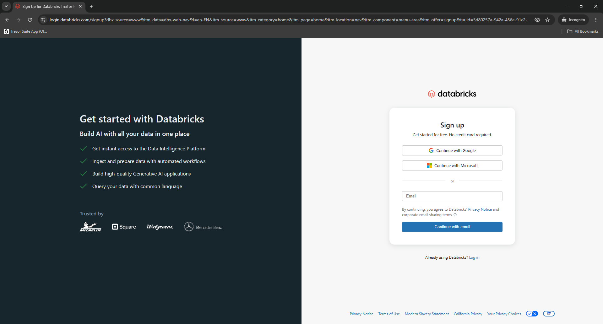

After submitting the form, verify your email address:

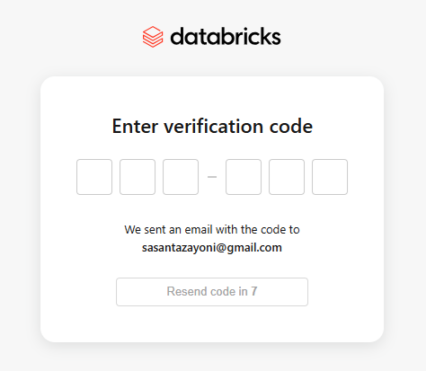

Once verified, you land in your Databricks workspace:

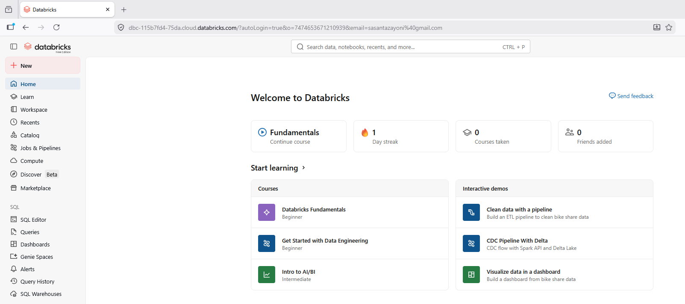

---

## How to Ingest Data

### Option 1 — Upload a file via the UI

1. In the left sidebar, go to **Catalog**

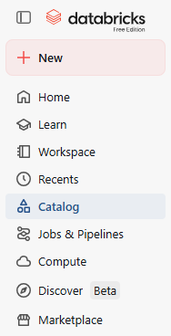

2. Click **+ Add** → **Add data**

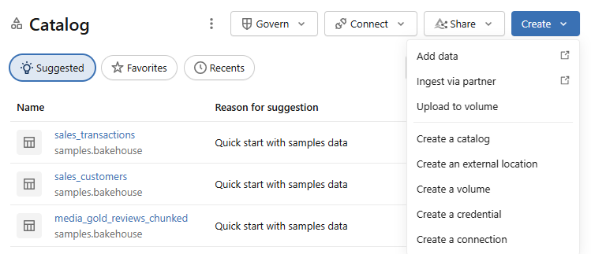

3. Choose **Create or modify table**

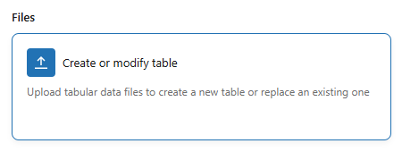

4. Drag and drop a CSV, JSON, or Parquet file — Databricks previews the data and infers the schema

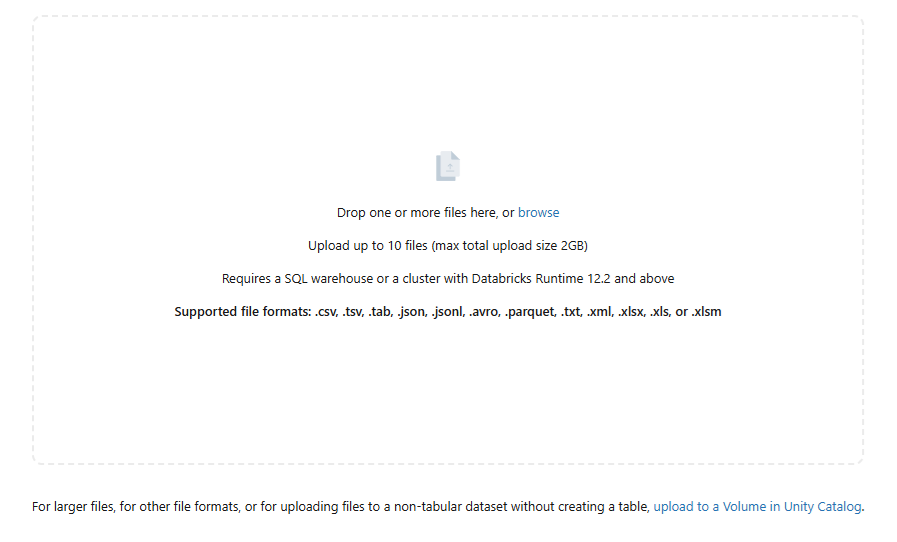

5. Click **Create table** — the data becomes a Delta table in Unity Catalog

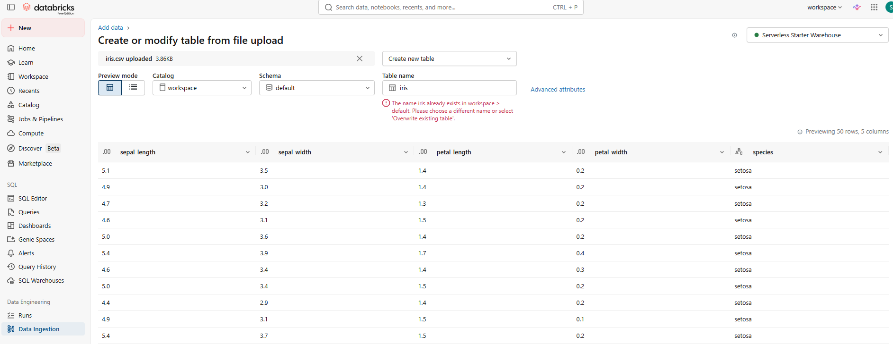

The table is then accessible as:

```python
df = spark.table("catalog_name.schema_name.table_name")
```

### Option 2 — Read a file from cloud storage

```python
# CSV
df = spark.read.format("csv").option("header", True).option("inferSchema", True).load("s3://my-bucket/data/file.csv")

# Parquet
df = spark.read.parquet("abfss://container@account.dfs.core.windows.net/path/file.parquet")

# JSON
df = spark.read.json("gs://my-bucket/data/file.json")
```

### Option 3 — Write a DataFrame to a Delta table

```python
df.write.format("delta").mode("overwrite").saveAsTable("catalog.schema.my_table")
```

`mode("overwrite")` replaces the table. Use `mode("append")` to add rows.

### Option 4 — Use Delta Live Tables (DLT) for pipelines

```python
import dlt

@dlt.table
def my_table():
    return spark.read.csv("/path/to/raw/data", header=True)
```

DLT handles scheduling, data quality checks, and incremental loading automatically.

---

## How to Create a Notebook

1. In the left sidebar, click **+ New** → **Notebook**

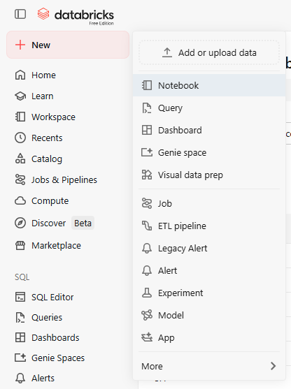

2. Give it a name and select the default language (**Python**, SQL, Scala, or R) — the notebook is created and opens immediately

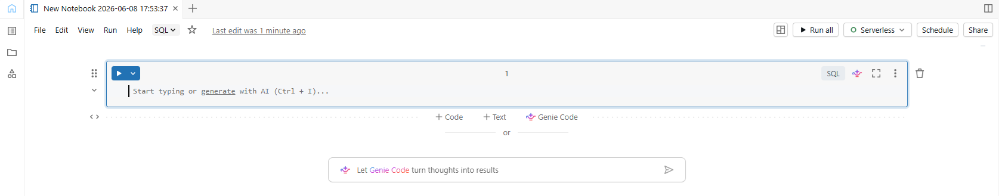

3. Attach it to a cluster — click the **Connect** dropdown and select a running cluster (or create a new one)

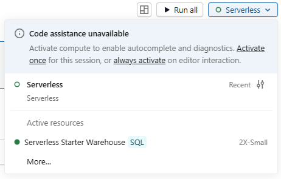

4. Write code in cells and run them with **Shift + Enter** (run cell and move to next) or **Ctrl/Cmd + Enter** (run cell, stay)


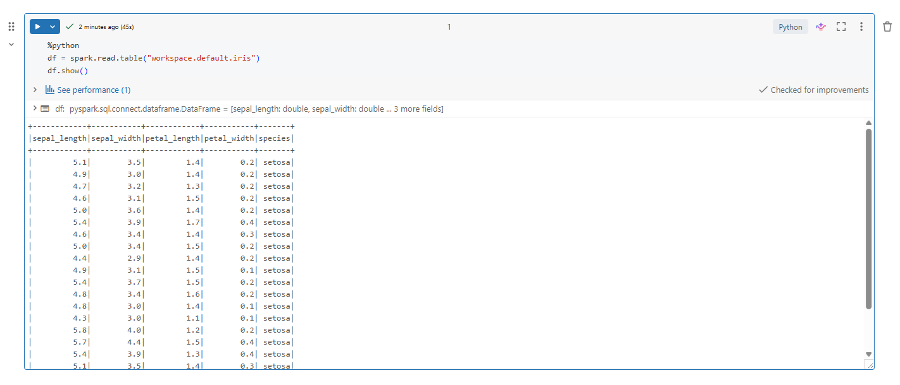

You can mix languages in a single notebook using magic commands at the top of a cell:

```python
# Default cell (Python)
df = spark.table("workspace.default.iris")
display(df)
```

```sql
-- %sql magic switches this cell to SQL
%sql
SELECT species, COUNT(*) as count
FROM workspace.default.iris
GROUP BY species
```

```python
# %md for markdown documentation cells
%md
## Section heading
This is a **markdown** cell.
```

Notebooks auto-save, support version history, and can be exported as `.ipynb`, `.py`, `.html`, or `.dbc` files via **File → Export**.

---

## PySpark Tasks

The following tasks use the iris dataset, stored as a Delta table at `workspace.default.iris`. Load it into a DataFrame at the top of your notebook before running any task:

```python
iris = spark.table("workspace.default.iris")
display(iris)
```

### Task 1 — Display the iris data as a DataFrame

`spark.table()` loads a Delta table from Unity Catalog into a PySpark DataFrame. `display()` renders it as an interactive table in Databricks — showing all rows, column headers, and data types.

```python
iris = spark.table("workspace.default.iris")
display(iris)
```

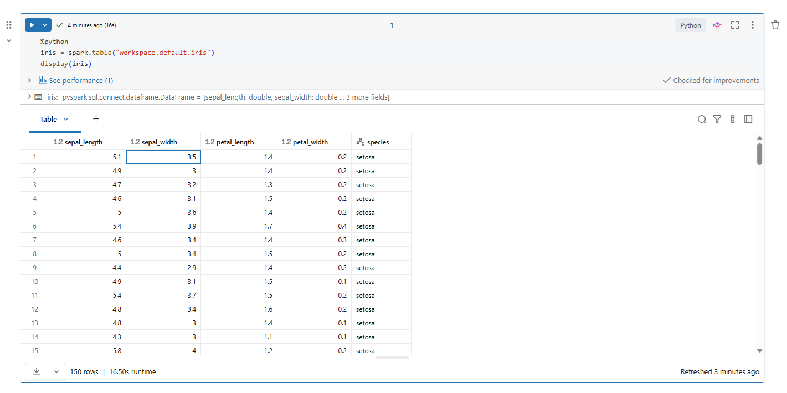

### Task 2 — Inspect the schema

`printSchema()` prints the DataFrame's schema as a readable tree — column names, data types, and whether each column is nullable. More readable than `.dtypes` for DataFrames with many or nested columns.

```python
iris.printSchema()
```

### Task 3 — Output the contained dtypes

`.dtypes` returns a list of tuples showing each column name paired with its data type as a plain Python list — useful for programmatic inspection (e.g. looping over columns to check types).

```python
iris.dtypes
```

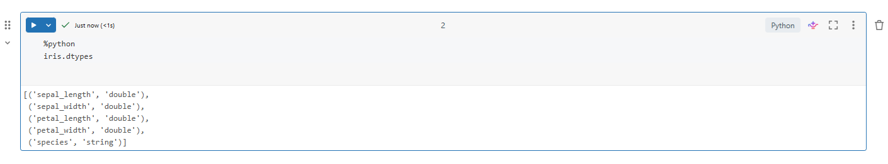

### Task 4 — Output columns

`.columns` returns a plain Python list of all column names in the DataFrame. Useful for programmatically referencing or looping over columns.

```python
iris.columns
```

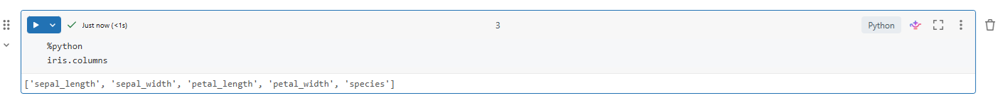

### Task 5 — Count the rows

`.count()` is an action that triggers execution and returns the total number of rows as a Python integer. It's one of the most commonly used actions for sanity-checking data after a filter or join.

```python
iris.count()
```

### Task 6 — Peek at the first rows

`.first()` returns the very first row as a `Row` object. `.take(n)` returns the first `n` rows as a Python list of `Row` objects. Both are useful for quickly inspecting data without loading the whole DataFrame.

```python
iris.first()
iris.take(3)
```

### Task 7 — Use the describe() method

`.describe()` generates summary statistics for each column — count, mean, standard deviation, min, and max. Only works on numeric and string columns. `.show()` prints the result as a table in the notebook output.

```python
iris.describe().show()
```

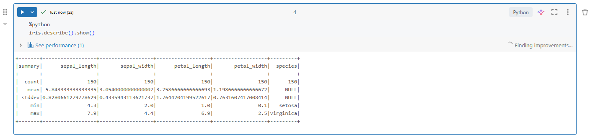

### Task 8 — Select the "sepal_length" column

`.select()` returns a new DataFrame containing only the specified column(s). This is the PySpark equivalent of `SELECT column FROM table` in SQL.

```python
iris.select("sepal_length").show()
```

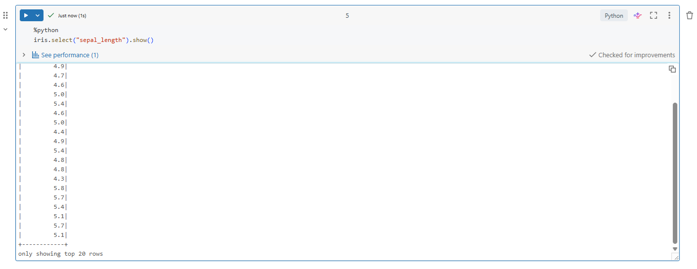

### Task 9 — Limit the output to 5 rows

`.limit(n)` returns a new DataFrame containing only the first `n` rows — equivalent to `SELECT ... LIMIT n` in SQL. Unlike `.take()`, it returns a DataFrame rather than a Python list, so further transformations can be chained.

```python
iris.limit(5).show()
```

### Task 10 — Get the distinct species

`.distinct()` removes duplicate rows from a DataFrame. Combined with `.select("species")`, it returns only the unique species values — equivalent to `SELECT DISTINCT species FROM iris` in SQL.

```python
iris.select("species").distinct().show()
```

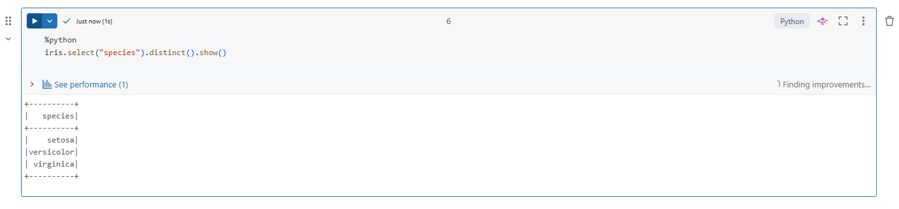

### Task 11 — Create a new DataFrame with the "species" column dropped

`.drop()` returns a new DataFrame with the specified column removed. The original `iris` DataFrame is unchanged — PySpark DataFrames are immutable.

```python
iris.drop("species").show()
```

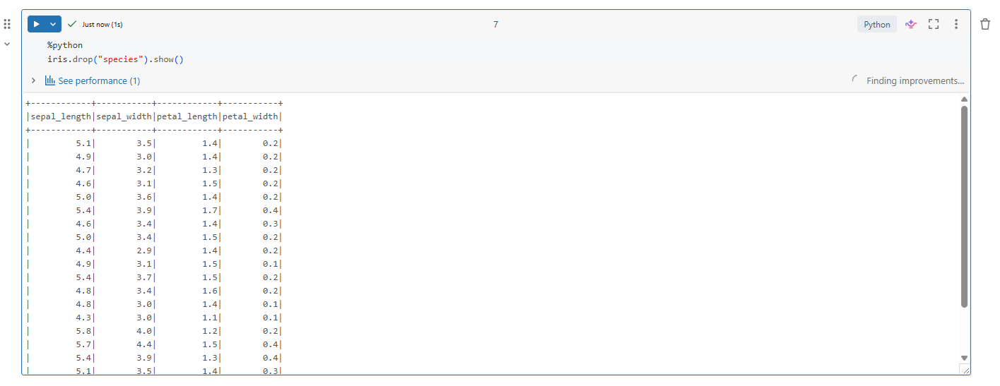

### Task 12 — Filter by sepal length over 5.5

`.filter()` returns a new DataFrame containing only rows that match the condition — equivalent to `WHERE` in SQL.

```python
iris.filter(iris.sepal_length > 5.5).show()
```

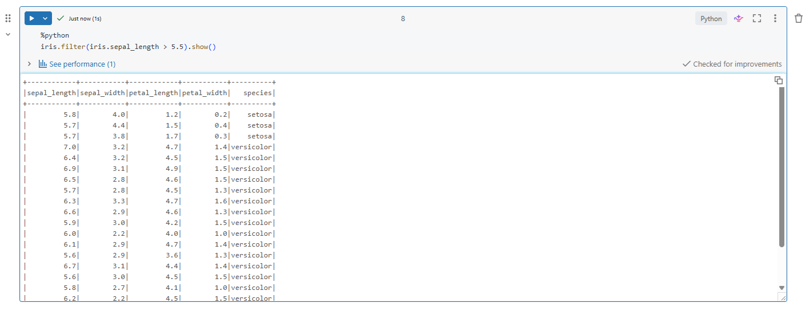

### Task 13 — Use the LIKE keyword to filter for species starting with "v"

`.like()` applies SQL-style pattern matching. `"v%"` means "starts with v" — the `%` is a wildcard matching any characters after it. This returns both `versicolor` and `virginica`.

```python
iris.filter(iris.species.like("v%")).show()
```

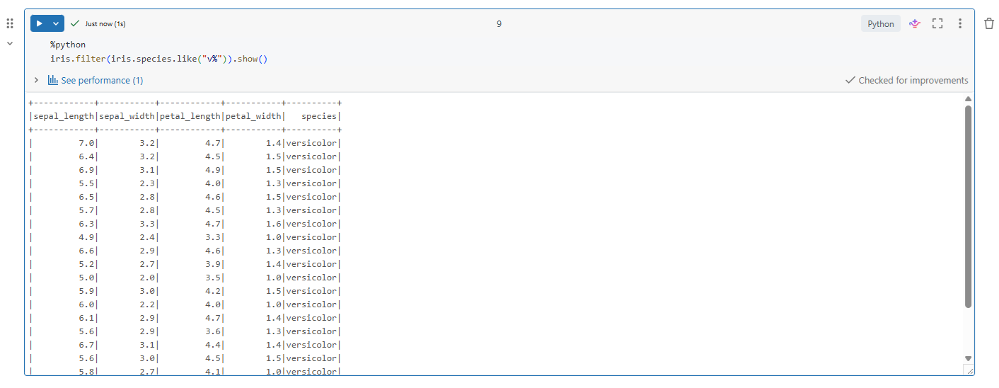

### Task 14 — Sort by sepal length descending

`.orderBy()` returns a new DataFrame sorted by one or more columns. By default the sort is ascending — wrap the column with `.desc()` to sort descending. `.sort()` is an alias for the same operation.

```python
from pyspark.sql.functions import desc

iris.orderBy(desc("sepal_length")).show()
```

### Task 15 — Group by species, find mean sepal width and max sepal length

`.groupBy()` groups rows by a column, and `.agg()` applies aggregate functions to each group. The dictionary maps column names to aggregate functions — equivalent to `GROUP BY` with `AVG` and `MAX` in SQL.

```python
iris.groupBy("species").agg({"sepal_width": "mean", "sepal_length": "max"}).show()
```

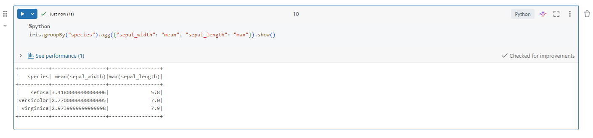

### Task 16 — Replace species names with initials

`.withColumn()` creates or replaces a column. `when()` works like a SQL `CASE WHEN` — it checks conditions in order and returns the matching value. `.otherwise()` is the fallback if no condition matches.

```python
from pyspark.sql.functions import when

iris.withColumn("species",
    when(iris.species == "virginica", "VI")
    .when(iris.species == "versicolor", "VE")
    .otherwise("SE")
).show()
```

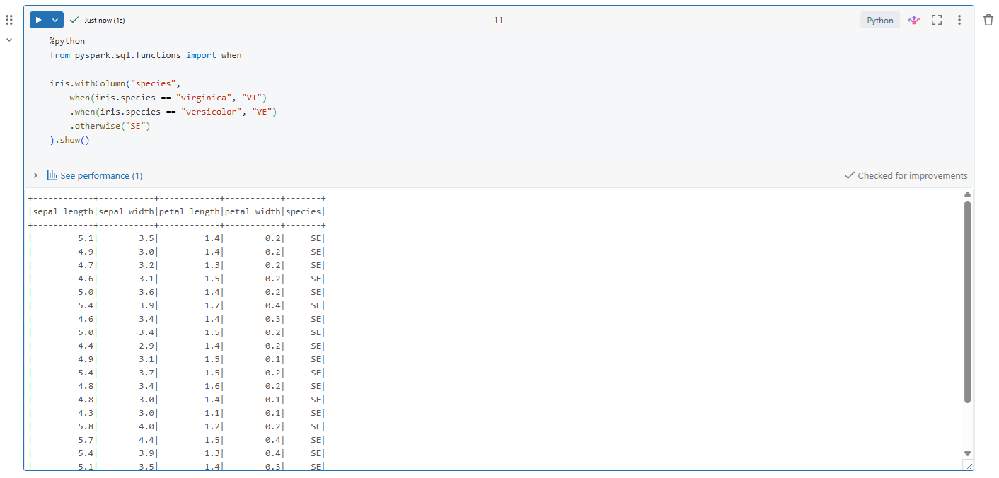

### Task 17 — Add missing values then drop rows with null species

`.replace()` swaps a specific value with `None` (null) across the DataFrame — here replacing all `0.2` values to simulate missing data. `.na.drop(subset=["species"])` then drops any rows where the species column is null. Since no species values were `0.2`, all rows are retained.

```python
irisna = iris.replace(0.2, None)
irisna.show()
```

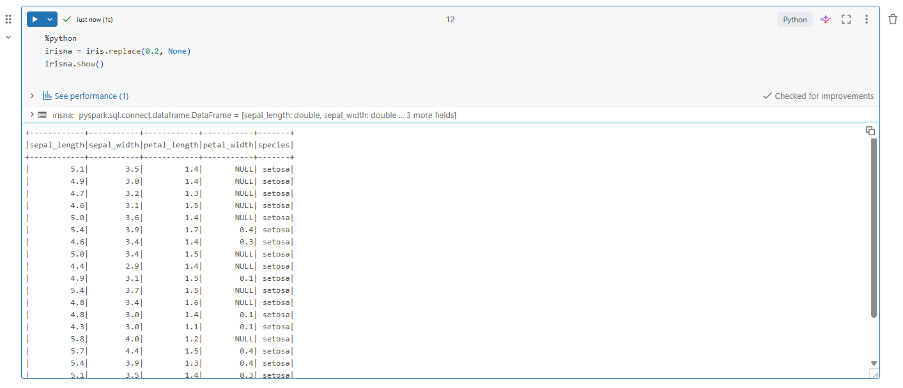

```python
irisna.na.drop(subset=["species"]).show()
```

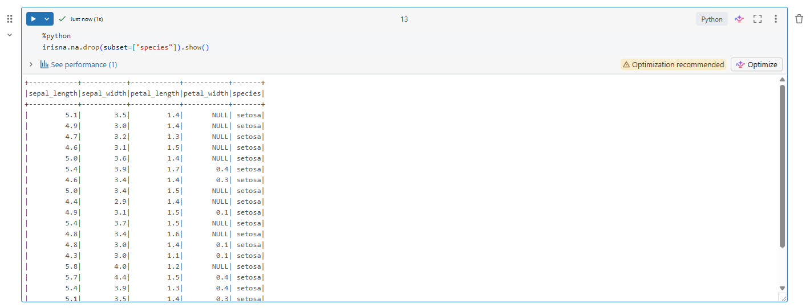

### Task 18 — Join two DataFrames on species

Two new DataFrames are created — one with the average sepal length per species, one with the max. `.join()` combines them on the `species` column, equivalent to `JOIN ON` in SQL. This produces a single row per species with both the avg and max values side by side.

```python
irisavg = iris.groupBy("species").agg({"sepal_length": "avg"})
irismax = iris.groupBy("species").agg({"sepal_length": "max"})
irisavg.join(irismax, irisavg.species == irismax.species).show()
```

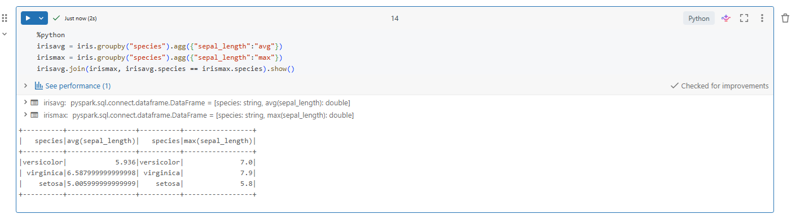

### Task 19 — Store a DataFrame as a SQL view

`.createOrReplaceTempView()` registers the DataFrame as a temporary SQL view in the Spark session. It doesn't persist any data — it just gives the DataFrame a name that SQL queries can reference. The view exists only for the duration of the session.

```python
iris.createOrReplaceTempView("iris_view")
```

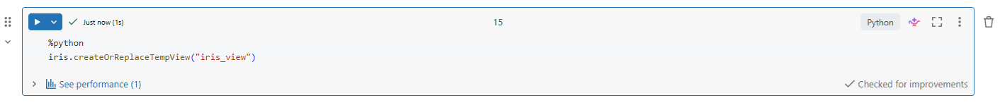

### Task 20 — Run a simple SQL SELECT query using PySpark

`spark.sql()` accepts a plain SQL string and runs it against any registered temp view. This bridges the gap between SQL and PySpark — useful when SQL is more readable than chaining DataFrame methods.

```python
spark.sql("SELECT * FROM iris_view WHERE sepal_length > 5.5").show()
```

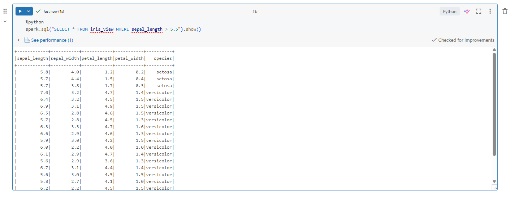
