# Intro to PySpark

## Setup

### 1. Ingest the iris dataset

The iris dataset was uploaded to Databricks as a Delta table via **Catalog → Create → Add data → Create or modify table**.

The table is stored at `workspace.default.iris`.

### 2. Create a notebook

A new notebook called `intro-to-pyspark` was created in the Databricks workspace.

### 3. Load the iris dataset as a PySpark DataFrame

```python
iris = spark.table("workspace.default.iris")
display(iris)
```

---

## Tasks

### Task 1 — Display the iris data as a DataFrame

`spark.table()` loads a Delta table from Unity Catalog into a PySpark DataFrame. `display()` renders it as an interactive table in Databricks — showing all rows, column headers, and data types.

```python
iris = spark.table("workspace.default.iris")
display(iris)
```

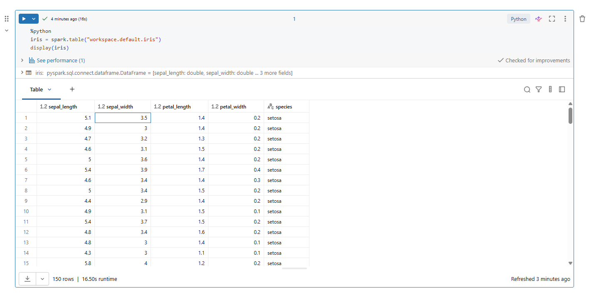

### Task 2 — Output the contained dtypes

`.dtypes` returns a list of tuples showing each column name paired with its data type. Useful for quickly checking whether columns have been inferred correctly — e.g. numeric columns should be `double` or `int`, not `string`.

```python
iris.dtypes
```

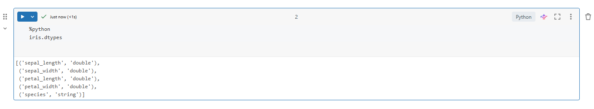

### Task 3 — Output columns

`.columns` returns a plain Python list of all column names in the DataFrame. Useful for programmatically referencing or looping over columns.

```python
iris.columns
```

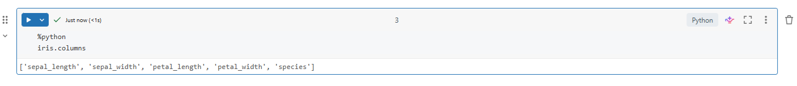

### Task 4 — Use the describe() method

`.describe()` generates summary statistics for each column — count, mean, standard deviation, min, and max. Only works on numeric and string columns. `.show()` prints the result as a table in the notebook output.

```python
iris.describe().show()
```

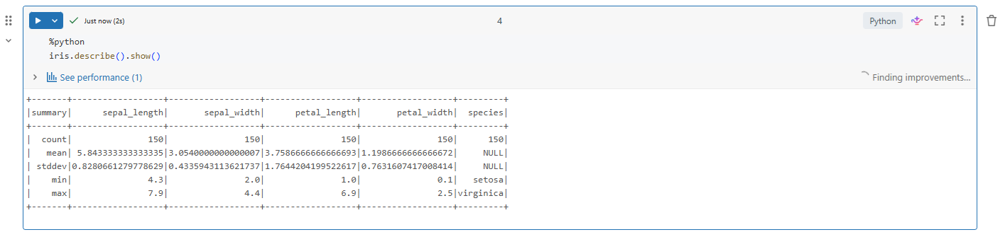

### Task 5 — Select the "sepal_length" column

`.select()` returns a new DataFrame containing only the specified column(s). This is the PySpark equivalent of `SELECT column FROM table` in SQL.

```python
iris.select("sepal_length").show()
```

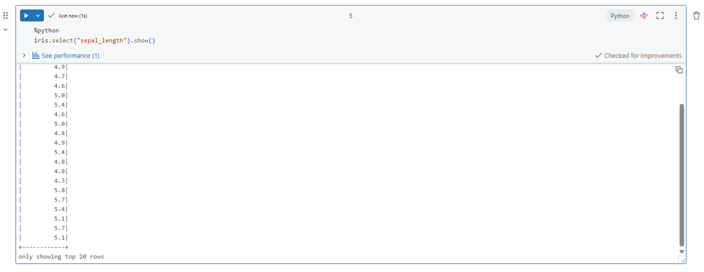

### Task 6 — Get the distinct species

`.distinct()` removes duplicate rows from a DataFrame. Combined with `.select("species")`, it returns only the unique species values — equivalent to `SELECT DISTINCT species FROM iris` in SQL.

```python
iris.select("species").distinct().show()
```

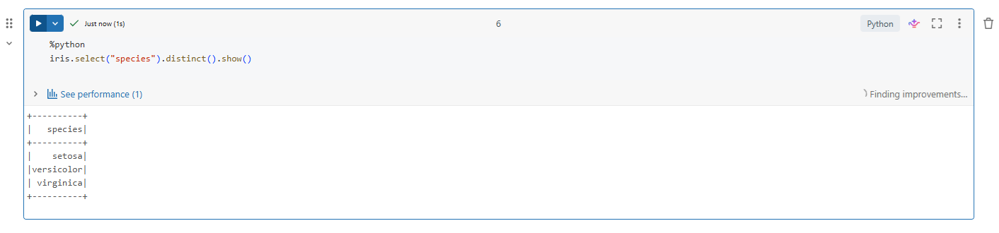

### Task 7 — Create a new DataFrame with the "species" column dropped

`.drop()` returns a new DataFrame with the specified column removed. The original `iris` DataFrame is unchanged — PySpark DataFrames are immutable.

```python
iris.drop("species").show()
```

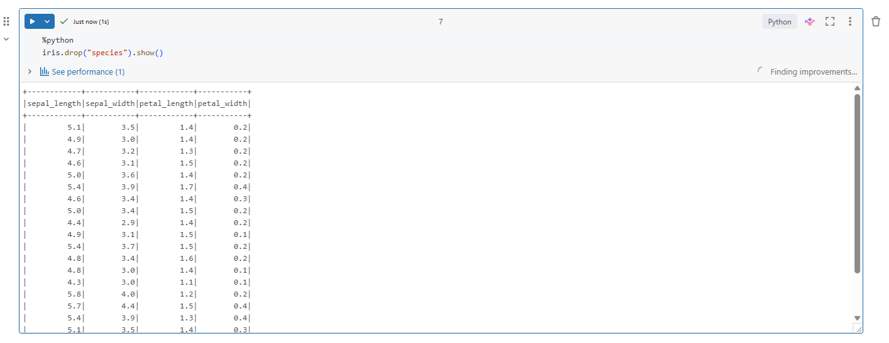

### Task 8 — Filter by sepal length over 5.5

`.filter()` returns a new DataFrame containing only rows that match the condition — equivalent to `WHERE` in SQL.

```python
iris.filter(iris.sepal_length > 5.5).show()
```

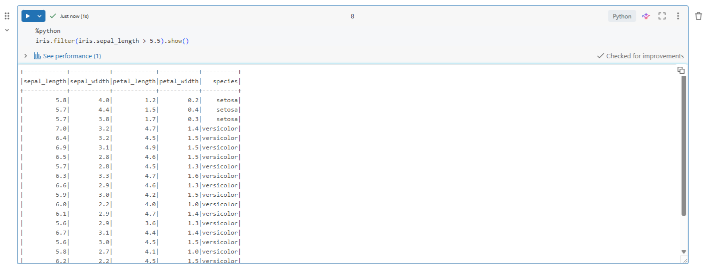

### Task 9 — Use the LIKE keyword to filter for species starting with "v"

`.like()` applies SQL-style pattern matching. `"v%"` means "starts with v" — the `%` is a wildcard matching any characters after it. This returns both `versicolor` and `virginica`.

```python
iris.filter(iris.species.like("v%")).show()
```

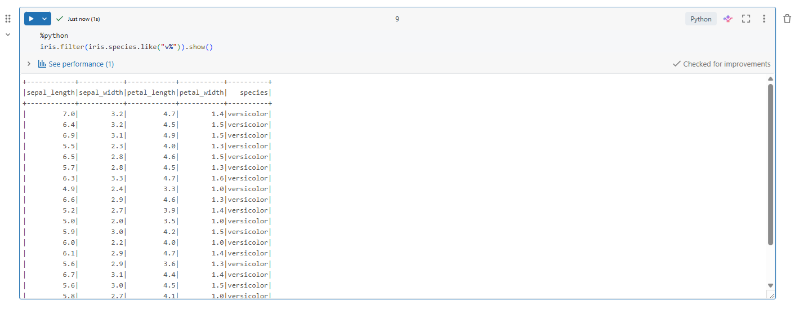

### Task 10 — Group by species, find mean sepal width and max sepal length

`.groupBy()` groups rows by a column, and `.agg()` applies aggregate functions to each group. The dictionary maps column names to aggregate functions — equivalent to `GROUP BY` with `AVG` and `MAX` in SQL.

```python
iris.groupBy("species").agg({"sepal_width": "mean", "sepal_length": "max"}).show()
```

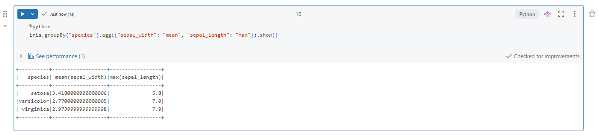

### Task 11 — Replace species names with initials

`.withColumn()` creates or replaces a column. `when()` works like a SQL `CASE WHEN` — it checks conditions in order and returns the matching value. `.otherwise()` is the fallback if no condition matches.

```python
from pyspark.sql.functions import when

iris.withColumn("species",
    when(iris.species == "virginica", "VI")
    .when(iris.species == "versicolor", "VE")
    .otherwise("SE")
).show()
```

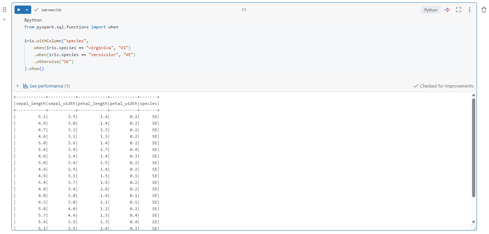

### Task 12 — Add missing values then drop rows with null species

`.replace()` swaps a specific value with `None` (null) across the DataFrame — here replacing all `0.2` values to simulate missing data. `.na.drop(subset=["species"])` then drops any rows where the species column is null. Since no species values were `0.2`, all rows are retained.

```python
irisna = iris.replace(0.2, None)
irisna.show()
```

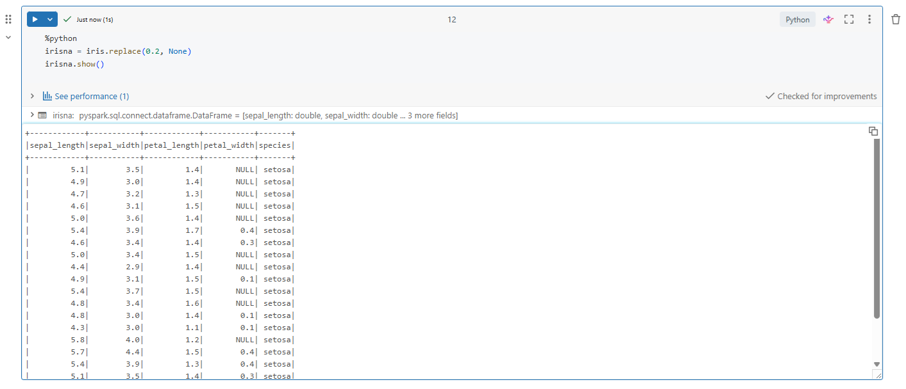

```python
irisna.na.drop(subset=["species"]).show()
```

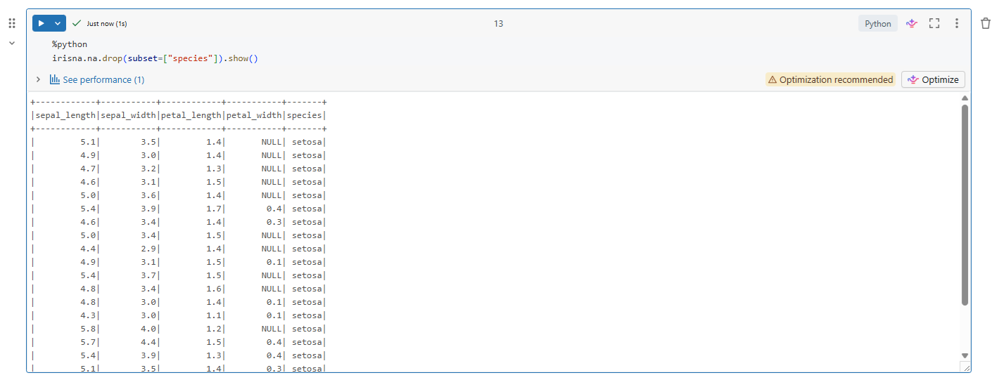

### Task 13 — Join two DataFrames on species

Two new DataFrames are created — one with the average sepal length per species, one with the max. `.join()` combines them on the `species` column, equivalent to `JOIN ON` in SQL. This produces a single row per species with both the avg and max values side by side.

```python
irisavg = iris.groupBy("species").agg({"sepal_length": "avg"})
irismax = iris.groupBy("species").agg({"sepal_length": "max"})
irisavg.join(irismax, irisavg.species == irismax.species).show()
```

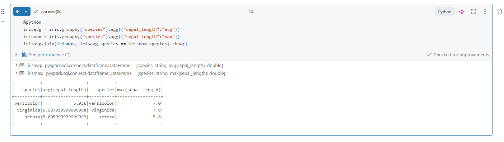

### Task 14 — Store a DataFrame as a SQL view

`.createOrReplaceTempView()` registers the DataFrame as a temporary SQL view in the Spark session. It doesn't persist any data — it just gives the DataFrame a name that SQL queries can reference. The view exists only for the duration of the session.

```python
iris.createOrReplaceTempView("iris_view")
```

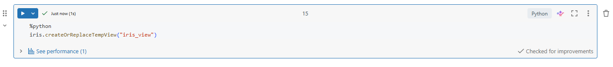

### Task 15 — Run a simple SQL SELECT query using PySpark

`spark.sql()` accepts a plain SQL string and runs it against any registered temp view. This bridges the gap between SQL and PySpark — useful when SQL is more readable than chaining DataFrame methods.

```python
spark.sql("SELECT * FROM iris_view WHERE sepal_length > 5.5").show()
```

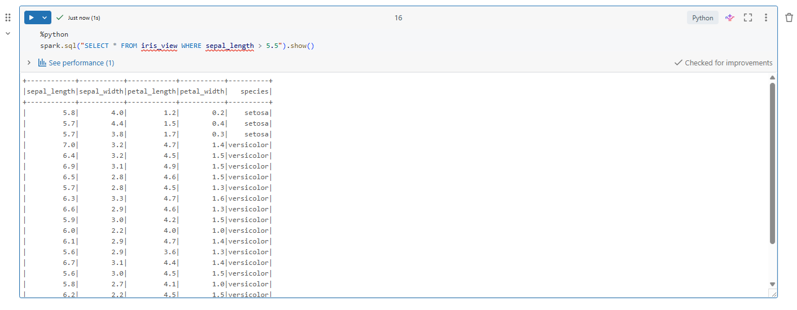
